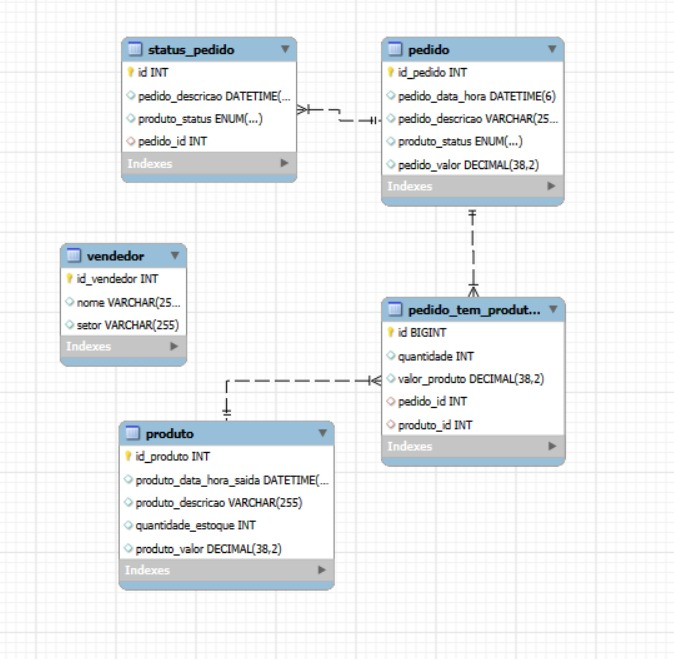

# Projeto E-commerce - Gerenciamento de Pedidos

## ℹ️ Descrição:

Este projeto é uma aplicação de e-commerce composta por três microsserviços: PedidosAPI, ProcessamentoAPI e NotificacaoAPI. Cada microsserviço é responsável por uma parte específica do fluxo de pedidos, desde a criação até a notificação.

## 🔎 Tecnologias Utilizadas

- **Java - Spring Boot**
- **MySQL**: Utilizado para persistência de dados através das entidades JPA.
- **RabbitMQ**: Utilizado para comunicação assíncrona entre os microsserviços.

## Microsserviços

### 🛒 PedidosAPI

PedidosAPI é uma aplicação *Spring Boot* que gerencia pedidos, utilizando *MySQL* para persistência e *RabbitMQ* para comunicação assíncrona.

#### Funcionalidades

- **Criar Pedido**: Permite a criação de novos pedidos.
- **Buscar Pedido por ID**: Recupera um pedido específico pelo seu ID.
- **Atualizar Pedido**: Atualiza as informações de um pedido existente.
- **Excluir Pedido**: Exclui um pedido existente.
- **Listar Todos os Pedidos**: Lista todos os pedidos cadastrados.

### 🔗 ProcessamentoAPI

ProcessamentoAPI é uma aplicação *Spring Boot* que gerencia o processamento de pedidos, utilizando *MySQL* para persistência e *RabbitMQ* para comunicação assíncrona.

#### Funcionalidades

- **Processar Pagamento**: Processa o pagamento de um pedido.
- **Reverter Processamento**: Reverte o status de um pedido processado para "em processamento".
- **Buscar Pedido Processado por ID**: Recupera um pedido processado específico pelo seu ID.
- **Listar Todos os Pedidos Processados**: Lista todos os pedidos com status de processamento.


### 📍 NotificacaoAPI

NotificacaoAPI é uma aplicação *Spring Boot* que gerencia a notificação de pedidos, utilizando *RabbitMQ* para comunicação assíncrona.

#### Funcionalidades

- **Enviar Notificação**: Envia notificações quando um pedido é processado.


### Modelo Logico:


## Como Executar:

1. Clone o repositório:
   ```sh
   git clone https://github.com/amandakelly3/Projeto-Accenture.git
   ```

2. Navegue até o diretório de cada microsserviço e execute o comando Maven para iniciar a aplicação:
   ```sh
   cd PedidosAPI            cd ProcessamentoAPI        cd NotificacaoAP
   mvn spring-boot:run      mvn spring-boot:run        mvn spring-boot:run
   ```

3. Acesse a documentação Swagger para testar os endpoints:
   
     ```      http://localhost:8080/swagger-ui/index.html#/        ```


## Integrantes:
- Amanda Kelly
- Gizele Gabriele

### Contribuição:

Contribuições são bem-vindas! Sinta-se à vontade para abrir uma issue ou enviar um pull request.
